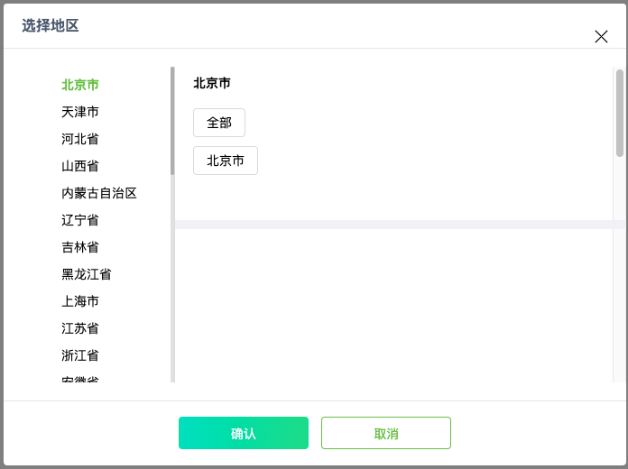
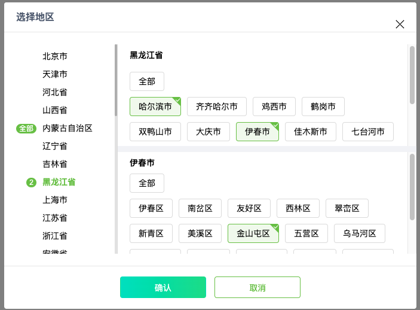
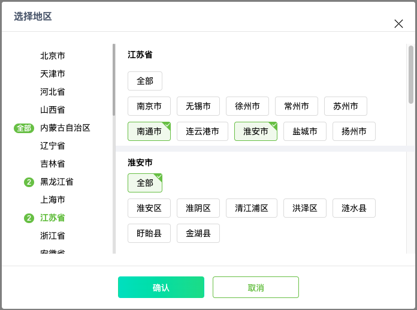

# 三级地址多选插件

[toc]

## 如果该插件对你有用，请不吝给个star

## 使用

该插件依赖jquery，数据来源 area.js文件,请先加载相关文件
该插件函数均暴露于window

+ 页面触发事件调用```ShowAreaPicker```函数，该函数接受一个回调函数为参数，回调函数参数为最终选中的地址信息
+ 如果有默认选中项，请设置```window.AreaPickerData```为默认数据，注意需符合格式

## 数据说明

    {
        index:1,    //该省份在area数据中的索引位置
        all:0,      //是否全部市选中，全选状态city为空数组
        province:"四川省",    //省份名
        city:[      
            {
                index:5,    //该市在area数据中的索引位
                label:"成都市", //市名
                value:"237132", //编号信息
                all:0,  //是否全部区选中,选中状态town为空数组
                town:[
                    {
                        label:"武侯区",     //区名
                        value:"3276189",    //编号
                    }
                ]
            },
            {
                index:6,
                label:"南充市",
                value:"234524",
                all:1,
                town:[]
            }
        ]
    }

## 效果演示

基础效果:


含市级选中计数:


可进行全部选中:


市、区级数据满选后自动勾选全部并去除该级所有单个选中
